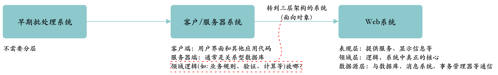

[toc]

### 1. 分层（Layering)

**分层（*Layering*）** 是分解复杂的软件系统最常用技术之一，如：FTP层架构在TCP层上，TCP架构在IP之上，IP又架构在以太网上。

分层的好处：

- 可以将某一层作为一个有机整体来理解，而无需过多了解其他层次。
- 可以替换某一层的具体实现，只需保证提供的服务相同即可。
- 可以将层次之间的依赖性减到最低。
- 分层有利于标准化工作。
- 一旦构建好某一层次，就可以用它为很多上层服务提供支持。

例如，在无需了解以太网的工作细节，可以基于TCP/IP构建FTP服务，同时TCP/IP可以被FTP、SSH、HTTP等使用，即使修改了TCP/IP的实现只要提供的服务不变，则FTP等服务就不会有影响，TCP和IP即是关于它们各自层次如何工作的标准。

分层的缺点：

- 层次不能封装所有东西，可能带来级联修改。
- 过多的层次会影响性能。

分层架构中最困难的问题是**决定建立哪些层次**和**每一层的职责是什么**。

从最初不需要层次到Web三层架构的系统，应用中层次的演化如下所示：

### 2. 三个基本层次（The Three Principal Layers）

三个基本层次的架构：**表现层（presentation）**、**领域层（domain）**和**数据源层（data source）**。

- 表现逻辑（presentation logic）处理用户与软件之间的交互。表现层的主要职责是：*向用户显示信息，并把从用户那里获取的信息解释成领域层或数据源层上的各种动作*。
- 数据源逻辑（data source logic）主要关注与其他系统的交互，如存储持久数据的数据库、事务监控器、消息系统、其他应用等等。
- 领域逻辑（domain logic）或业务逻辑（business logic）是应用必须做的所有领域相关的工作：验证表现层输入数据、调度数据源逻辑、根据输入数据或已有数据进行计算等等。

> Hexagonal Architecture（六边形架构）模式，由Alistair Cockburn发明，它将任何系统都视为由到外部系统的接口所围绕的一个核心，在Hexagonal Architecture中，所有外部的东西都视为外部接口，它是一种对称视图。而这里讨论的是非对称分层视图。

依赖性的普遍原则：*领域层和数据源层绝对不要依赖于表现层*。

使用领域逻辑时，其中一个最困难的部分就是**区分什么是领域逻辑，什么是其他逻辑**。一种不太正规的测试方法：假想向系统中增加一个完全不同的新层，例如Web应用中增加一个命令行界面层，如果发现需要重复实现某些功能，则说明可能一些本应该在领域层实现的逻辑，在表现层实现了。