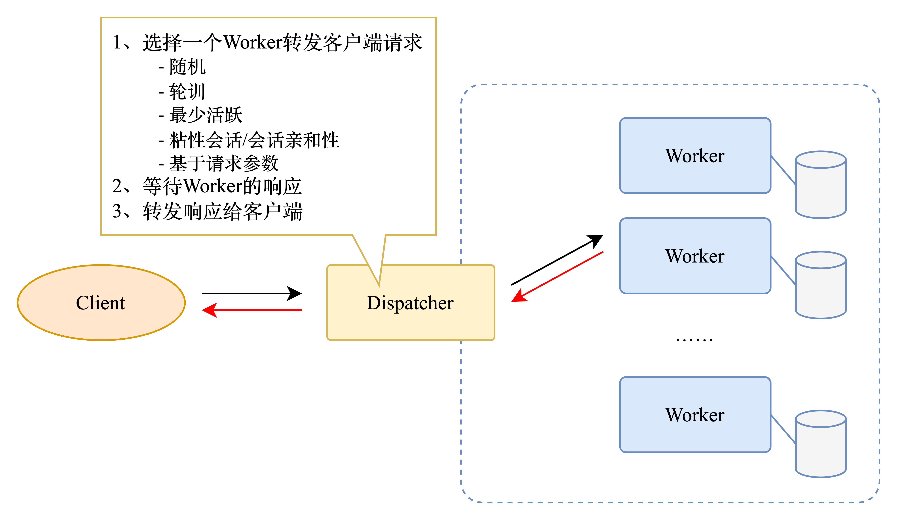

# 可扩展的系统设计模式

原文来源：[Scalable System Design Patterns](http://horicky.blogspot.com/2010/10/scalable-system-design-patterns.html)

## 负载均衡器

在这个模型中，有一个调度程序根据不同的策略确定哪个工作实例将处理请求。

应用程序最好是“无状态”的，这样任何工作实例都可以处理请求。

这种模式几乎部署在每个大中型网站设置中。

